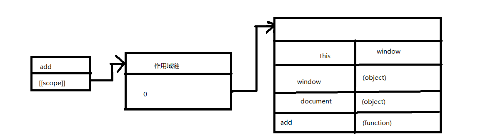

# 数据存取

有字面量、本地变量、数组元素和对象成员四种存取方式

而存取字面量、本地变量的开销小于数组元素和对象成员的开销

### 管理作用域

#### 作用域链和标识符解析

函数内部属性[[Scope]]包含了在该函数内的可访问的对象的集合，这个集合被称为函数的作用域链。集合的首项是一个包含全局范围内定义的变量的对象。

```javascript
fucntion add(num1, num2) {
	var sum = num1 + num2;
	return sum;
}
```



函数执行时会生成执行环境的内部对象，执行环境有自己的作用域链[[Scope]]。当函数执行完，执行环境就会被销毁。

执行环境的[[Scope]]初始化为当前函数[[Scope]]属性，然后根据执行环境的局部变量生成一个活动对象，并推到[[Scope]]属性的顶部。

```javascript
var total = add(5, 10);
```


**在解析标识符时是有性能开销的，越内部或作用域越顶层的存取开销越小。故如果要多次使用底层（或外部）的变量可以先在内部声明。**

#### 改变作用域链

with(e){}	

e会提到作用域链首位，如果多次存取e且e在作用域链很底部，可使用with

try{}catch(e){}

e会提到作用域链首位，在确保可能错误的情况下委托错误处理函数

```javascript
try{
	somethineThatMightCauseAnError()
} catch(ex) {
	handleError(ex)
}
```

#### 动态作用域

```javascript
function execute(code){
	eval(code);
	function subroutine(){return window;}
	var w = subroutine();
}
//无法确定w是什么，因为运行execute("var window = {};")时，w就是取{}而不是取全局对象window。
```

with、try-catch和eval语句都被认为是动态作用域的,动态作用域只存在代码执行过程中，因此无法通过静态分析，会使一些针对变量存取的优化失效。这些优化是通过分析代码确定哪些变量可以在特定时候被访问，然后别开传统作用域链查找，取代以标识符索引查找的方式快速查找，所以当涉及动态作用域时，这种优化会失效。

#### 闭包、作用域和内存

```javascript
function assignEvents(){
	var id = "xdi9592";
	document.getElmentById("save-btn").onclick = function(event){
		saveDocument(id)
	}
}
```

##### 内存泄漏

在上面例子中，闭包函数的[[Scope]]和assignEvents的执行环境[[Scope]]相同，在assignEvents执行结束时销毁执行环境，由于闭包函数的[[Scope]]还在引用局部变量id，故导致局部变量id不会被释放，IE由于使用非原生javascript对象实现DOM对象，这会导致内存泄漏。

##### 多层存取

在saveDocument的执行环境内存取属性id和函数saveDocument，会跨多层作用域，频繁跨作用域存取也会带来性能损失，**故应该将跨作用域变量存在局部变量中。**

### 对象成员

#### 原型链

对象可以从原型继承属性，查找顺序是先找自身，在一层层往父级找，**故存取父级层数越高的属性，性能消耗越大**。

#### 嵌套成员

点操作符会查找对象的所有属性，**故应嵌套层级会影响性能开销。**

### 缓存对象成员

**当要多次使用对象成员时，应该使用变量缓存对象成员在使用，减少属性搜索的性能开销。**